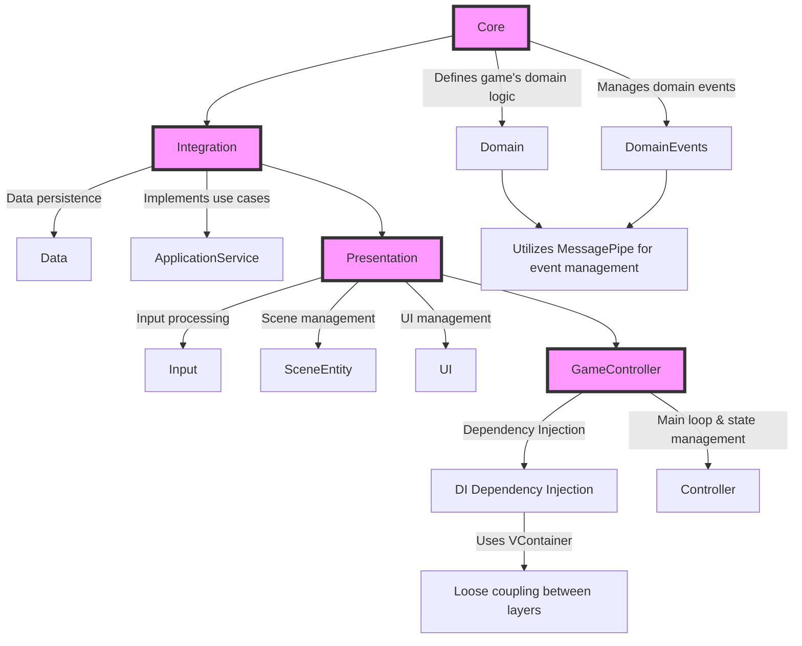

Architecture Overview

## Overview

This Architecture is a game development architecture for Unity, designed based on DDD (Domain-Driven Design) and event-driven approach. This architecture aims to achieve flexible feature expansion and high reusability of component design in game development.

In the event-driven part, it adopts the Pub/Sub (Publish/Subscribe) pattern, making it easy to publish and subscribe to events throughout the system. Also, by using a DI (Dependency Injection) container, it efficiently manages dependencies between classes and improves testability.

To make it easy for Unity developers to adopt, it utilizes the following libraries:

- Pub/Sub pattern library: MessagePipe
- DI container library: VContainer

The architecture is divided into four layers, each with more detailed sub-layers.

## 1. Core

The heart of the application that defines the game's domain logic and common interfaces. Here, only pure C# is used, and UnityEngine is not used, to define the basic rules and structure of the game.

- **1.1 Domain**
    This layer defines the core domain logic of the game. 
    - Model : 
    Defines basic entities in the game, such as players, items, enemies, etc. These represent 'what' the game is.
    - Service : 
    Handles complex business logic that occurs between entities. Here, it defines 'how' entities interact with each other. For example, item trading, combat logic, etc.
- **1.2 DomainEvents**
    - Defines important events that occur in the game and manages how they occur and are handled. It adopts an event-driven approach to enhance the reactivity of the game. It defines messages to be published with MessagePipe.

## 2. Integration

Bridges between Core and Unity, and external systems (databases, APIs, etc.). Unity classes and external services are used from here.

- **2.1 Data**
    - The data access layer responsible for data persistence. It uses `ScriptableObject` and database access classes.
- **2.2 ApplicationService**
    - Implements use cases, subscribes to domain events, and executes business logic.

## 3. Presentation

Manages UI, objects in the game scene, and user input. Here, Unity's features are fully utilized.

- **3.1 Input**
    - Handles user input reception and processing. It uses the new Input System, old Input Manager, and custom input classes.
- **3.2 SceneEntity**
    - Manages game objects in the scene. Here, classes that inherit from `MonoBehaviour` are often used.
- **3.3 UI**
    - Manages in-game UI and game objects using the MVP pattern.

## 4. GameController

Manages the progress of the entire game and integrates the functions of the Core, Integration, and Presentation layers.

- **4.1 Controller**
    - Responsible for the game's main loop and state management. It manages the triggers for scene transitions and game state changes.
- **4.2 Installer**
    - Handles the creation of objects in the scene and the resolution of dependencies. Here, it uses VContainer (implementation of LifetimeScope, etc.) to maintain loose coupling between layers.
  
## Layer Diagram
